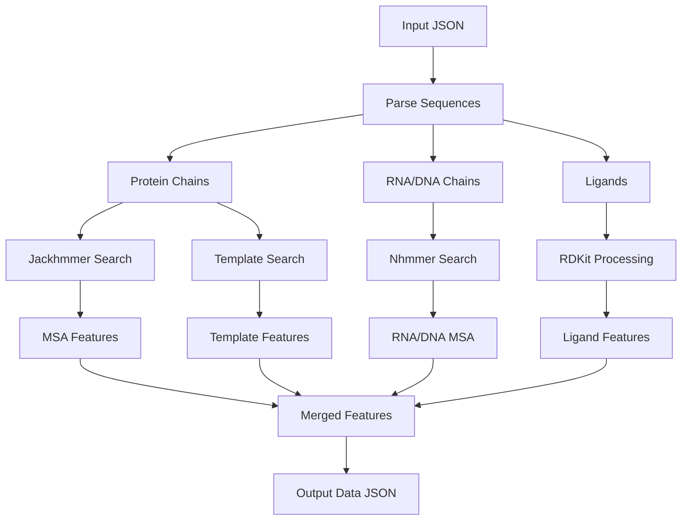

## Overview

The AlphaFold 3 data pipeline transforms raw input sequences into rich feature representations by searching genetic and structural databases. This CPU-intensive stage can be run independently from the GPU inference stage.

<Info>
The data pipeline is controlled by `--run_data_pipeline=true` and produces a `*_data.json` file containing all features needed for inference.
</Info>

## Pipeline Architecture

The data pipeline consists of three parallel search processes:



## Entry Point

The data pipeline is orchestrated by `src/alphafold3/data/pipeline.py`:

```python
# From src/alphafold3/data/pipeline.py:71
def _get_protein_msa_and_templates(
    sequence: str,
    run_template_search: bool,
    uniref90_msa_config: msa_config.RunConfig,
    mgnify_msa_config: msa_config.RunConfig,
    small_bfd_msa_config: msa_config.RunConfig,
    uniprot_msa_config: msa_config.RunConfig,
    templates_config: msa_config.TemplatesConfig,
    pdb_database_path: str,
) -> tuple[msa.Msa, msa.Msa, templates_lib.Templates]:
```

<Note>
The pipeline uses `@functools.cache` to avoid re-running searches for identical sequences in homomers, significantly improving performance for symmetric complexes.
</Note>

## Protein MSA Generation

### Overview

Protein MSA generation searches multiple genetic databases to find homologous sequences:

<Steps>
  <Step title="UniRef90 Search">
    Primary search against clustered UniProt database
  </Step>
  
  <Step title="MGnify Search">
    Search metagenomic sequences for additional diversity
  </Step>
  
  <Step title="Small BFD Search">
    Search BFD (Big Fantastic Database) for deeper evolutionary coverage
  </Step>
  
  <Step title="UniProt Search">
    Paired MSA search for multimer pairing information
  </Step>
</Steps>

### Parallel Execution

MSA tools run in parallel using a thread pool:

```python
# From src/alphafold3/data/pipeline.py:85
with futures.ThreadPoolExecutor(max_workers=4) as executor:
    uniref90_msa_future = executor.submit(
        msa.get_msa,
        target_sequence=sequence,
        run_config=uniref90_msa_config,
        chain_poly_type=mmcif_names.PROTEIN_CHAIN,
    )
    mgnify_msa_future = executor.submit(...)
    small_bfd_msa_future = executor.submit(...)
    uniprot_msa_future = executor.submit(...)
```

This parallelization significantly reduces wall-clock time for the data pipeline.

### Jackhmmer Tool

Jackhmmer performs iterative sequence search:

```python
# From src/alphafold3/data/tools/jackhmmer.py
class Jackhmmer:
    """Runs Jackhmmer to search for homologous sequences."""
    
    def query(self, query_seq: str) -> str:
        """Runs jackhmmer search."""
        # Returns results in A3M format
```

**Key parameters**:
- **e_value**: Statistical significance threshold (default: 0.0001)
- **iterations**: Number of search iterations (default: 1)
- **z_value**: Database size for E-value calculation

<Accordion title="Database Configuration">
**UniRef90** (`uniref90_2022_05`):
- Clustered at 90% sequence identity
- Fast initial search
- Good balance of speed and coverage

**MGnify** (`mgy_clusters_2022_05`):
- Metagenomic sequences
- Diverse environmental samples
- Complements UniRef with novel sequences

**Small BFD** (`bfd-first_non_consensus_sequences.fasta`):
- Large, diverse sequence database
- Can be sharded for faster searching
- Deepest evolutionary coverage

Database paths configured via flags:
```bash
--uniref90_database_path='${DB_DIR}/uniref90_2022_05.fasta'
--mgnify_database_path='${DB_DIR}/mgy_clusters_2022_05.fa'
--small_bfd_database_path='${DB_DIR}/bfd-first_non_consensus_sequences.fasta'
```
</Accordion>

### MSA Processing

Raw MSA results are processed into a structured format:

```python
# From src/alphafold3/data/msa.py:52
class Msa:
    """Multiple Sequence Alignment container."""
    
    def __init__(
        self,
        query_sequence: str,
        chain_poly_type: str,
        sequences: Sequence[str],
        descriptions: Sequence[str],
        deduplicate: bool = True,
    ):
```

**Processing steps**:

1. **Deduplication**: Remove identical sequences (ignoring insertions)
2. **Validation**: Ensure first sequence matches query
3. **Format conversion**: Convert to A3M format (gaps as `-`, insertions as lowercase)

```python
# From src/alphafold3/data/msa.py:89
# A replacement table that removes all lowercase characters
deletion_table = str.maketrans('', '', string.ascii_lowercase)
sequence_no_deletions = seq.translate(deletion_table)
```

### MSA Pairing for Multimers

When predicting complexes, MSA pairing ensures sequences from the same organism align:

```python
# From src/alphafold3/model/msa_pairing.py
def pair_msas(
    msas: Sequence[Msa],
    max_hits: int = 10000,
) -> PairedMsa:
    """Pairs MSAs based on organism identifiers."""
```

<Info>
Pairing uses UniProt organism IDs extracted from sequence headers. Properly paired MSAs significantly improve multimer prediction quality by preserving co-evolutionary signals.
</Info>

**Pairing strategies**:
- Match sequences by organism ID in headers
- Preserve relative positioning of paired sequences
- Insert gaps for unpaired sequences

Users can provide custom paired MSAs via the `unpairedMsa` field to maintain exact control over pairing.

## RNA/DNA MSA Generation

### Nhmmer Search

RNA and DNA use Nhmmer instead of Jackhmmer:

```python
# From src/alphafold3/data/tools/nhmmer.py
class Nhmmer:
    """Runs Nhmmer to search for homologous nucleic acid sequences."""
```

**Databases**:
- **RFam**: RNA families database
- **RNACentral**: Comprehensive RNA sequence database
- **NT**: Nucleotide database for DNA

Configuration:
```bash
--rfam_database_path='${DB_DIR}/rfam_14_4.fa'
--rnacentral_database_path='${DB_DIR}/rnacentral_21_0.fa'
--nt_database_path='${DB_DIR}/nt_rna_2023_02_23.fa'
```

### Processing

RNA/DNA MSA processing follows similar steps to protein:
1. Search genetic databases
2. Parse results in STOCKHOLM/A3M format
3. Deduplicate sequences
4. Validate against query sequence

<Note>
RNA/DNA MSAs are generally shallower than protein MSAs due to fewer available sequences in databases. This is expected and does not necessarily indicate poor prediction quality.
</Note>

## Template Search

### Overview

Template search finds structurally similar proteins in the PDB to provide spatial priors:

```python
# From src/alphafold3/data/pipeline.py:30
def _get_protein_templates(
    sequence: str,
    input_msa_a3m: str,
    run_template_search: bool,
    templates_config: msa_config.TemplatesConfig,
    pdb_database_path: str,
) -> templates_lib.Templates:
    """Searches for templates for a single protein chain."""
```

### Hmmsearch Tool

Template search uses Hmmsearch:

<Steps>
  <Step title="Build HMM Profile">
    Create Hidden Markov Model from MSA using Hmmbuild
  </Step>
  
  <Step title="Search PDB">
    Search profile against PDB sequence database using Hmmsearch
  </Step>
  
  <Step title="Filter Results">
    Apply date, identity, and quality filters
  </Step>
  
  <Step title="Extract Structures">
    Retrieve and process template structures from PDB
  </Step>
</Steps>

### Template Filtering

Templates are filtered based on several criteria:

```python
# From src/alphafold3/data/templates.py
class TemplateFilterConfig:
    max_template_date: datetime.date    # Exclude structures after this date
    max_subsequence_ratio: float = 0.95  # Filter nearly complete sequences
    min_align_ratio: float = 0.1        # Minimum alignment coverage
    max_hits: int = 20                  # Maximum templates to keep
```

<Info>
**max_template_date** is critical for fair benchmarking. Set to the earliest date that ensures the target was not in the training set (e.g., training cutoff date).
</Info>

**Filtering logic**:

1. **Date filter**: Remove templates released after `max_template_date`
2. **Self-hit filter**: Remove if `> 95%` of query aligns (likely same protein)
3. **Coverage filter**: Require `> 10%` alignment coverage
4. **Quality sort**: Rank by sequence identity and resolution
5. **Top-K selection**: Keep best `max_hits` templates (default: 20)

### Template Processing

Selected templates are processed into model inputs:

```python
# From src/alphafold3/data/templates.py
class Templates:
    query_sequence: str
    hits: list[TemplateHit]
    max_template_date: datetime.date
    structure_store: structure_stores.StructureStore
```

**Each template provides**:
- **Aligned coordinates**: 3D positions for aligned residues
- **Sequence alignment**: Mapping from query to template
- **Metadata**: Resolution, release date, confidence scores
- **Template features**: Distance maps, angles, masks

### Structure Store

Templates are retrieved from a local PDB mirror:

```python
# From src/alphafold3/data/structure_stores.py
class StructureStore:
    """Provides access to PDB structures."""
    
    def __init__(self, database_path: str):
        self.database_path = database_path
```

The structure store:
- Loads mmCIF files from local PDB mirror
- Caches parsed structures
- Handles missing or malformed entries
- Extracts relevant chains

### Template-Free Mode

Templates can be disabled for template-free prediction:

```json
{
  "protein": {
    "id": "A",
    "sequence": "ACDEFGHIKLMNPQRSTVWY",
    "templates": []
  }
}
```

Or by setting `--run_template_search=false` in the pipeline.

## Ligand Processing

### Chemical Component Dictionary (CCD)

Ligands specified by CCD codes are processed directly:

```python
# From src/alphafold3/constants/chemical_components.py
def get_ccd_component(ccd_code: str) -> ChemicalComponent:
    """Retrieves chemical component from CCD."""
```

CCD provides:
- Atom names and elements
- Bond connectivity and orders
- Ideal coordinates
- Chemical properties

### SMILES Processing

Ligands specified by SMILES are processed via RDKit:

```python
# From src/alphafold3/data/tools/rdkit_utils.py
def smiles_to_mol(smiles: str) -> Chem.Mol:
    """Convert SMILES to RDKit Mol object."""
```

**Processing steps**:

<Steps>
  <Step title="Parse SMILES">
    Convert SMILES string to RDKit Mol object
  </Step>
  
  <Step title="Generate 3D Conformer">
    Use RDKit ETKDG algorithm to generate reference geometry
  </Step>
  
  <Step title="Extract Features">
    Extract atoms, bonds, charges, and coordinates
  </Step>
  
  <Step title="Create Ligand Features">
    Convert to model-compatible feature format
  </Step>
</Steps>

<Accordion title="Conformer Generation">
RDKit conformer generation parameters:

```python
# Configurable via flags
--conformer_max_iterations=<N>  # Max iterations for conformer search
```

If conformer generation fails:
1. Try increasing `--conformer_max_iterations`
2. Use user-provided CCD with ideal coordinates
3. Model will output NaN confidences for ligand if no coordinates available

Common failure cases:
- Very flexible molecules
- Unusual ring systems
- Macrocycles
</Accordion>

### User-Provided CCD

Custom ligands can be defined in mmCIF format:

```json
{
  "userCCD": "data_MY-LIG\n_chem_comp.id MY-LIG\n...",
  "sequences": [
    {
      "ligand": {
        "id": "L",
        "ccdCodes": ["MY-LIG"]
      }
    }
  ]
}
```

This enables:
- Custom ligands not in standard CCD
- Covalent bond specifications
- Reference coordinates for difficult conformers

## Feature Merging

After all searches complete, features are merged:

```python
# From src/alphafold3/model/merging_features.py
def merge_chain_features(
    protein_msas: dict[str, Msa],
    rna_msas: dict[str, Msa],
    templates: dict[str, Templates],
    ligand_features: dict[str, LigandFeatures],
) -> MergedFeatures:
```

**Merging process**:

1. **Concatenate chains**: Combine all chains into single tensors
2. **Align MSAs**: Ensure MSA depths match across chains
3. **Pad templates**: Standardize template dimensions
4. **Create masks**: Track valid positions and features
5. **Compute relative encodings**: Chain boundaries, positions
6. **Generate atom layout**: Map tokens to atoms

### MSA Depth Balancing

MSAs are subsampled/padded to consistent depth:

```python
# Configuration
max_msa_depth = 1024  # Maximum MSA sequences

# If MSA exceeds max_depth: cluster and subsample
# If MSA below max_depth: pad with gaps
```

### Output Format

The merged features are serialized to `*_data.json`:

```json
{
  "name": "my_protein",
  "sequences": [...],
  "msa_features": {
    "msa": [[...]],  // [num_chains, num_msa, num_tokens]
    "deletion_matrix": [...],
    "descriptions": [...]
  },
  "template_features": {
    "template_aatype": [...],
    "template_all_atom_positions": [...],
    // ... more template features
  },
  "token_features": {...},
  "atom_features": {...}
}
```

This file contains everything needed for inference, enabling data/inference separation.

## Performance Optimization

### Parallelization

The pipeline parallelizes across:
- **Multiple databases**: UniRef90, MGnify, BFD run in parallel
- **Multiple chains**: Independent searches run concurrently
- **Tool invocations**: Jackhmmer instances run in separate threads

### Caching

```python
# From src/alphafold3/data/pipeline.py:29
@functools.cache
def _get_protein_templates(...):
    """Searches for templates for a single protein chain."""
```

Caching prevents redundant searches for:
- Homomeric complexes (same sequence repeated)
- Multiple runs with same input
- Identical chains in different complexes

### Database Sharding

Large databases can be sharded for faster access:

```bash
# Sharded database support
--small_bfd_database_path='${DB_DIR}/bfd_shard_*.fasta'
--small_bfd_z_value=123456789  # Total database size
```

Sharding enables:
- Faster I/O on parallel filesystems
- Distributed search across multiple nodes
- Reduced memory footprint per shard

## Error Handling

<Accordion title="MSA Search Failures">
If MSA search fails (e.g., database unavailable):
- Pipeline continues with empty MSA (just query sequence)
- Prediction quality will be reduced
- Check database paths and permissions

```python
# Graceful degradation
if msa_search_failed:
    logging.warning("MSA search failed, using query only")
    msa = Msa(query_sequence, chain_poly_type, [], [])
```
</Accordion>

<Accordion title="Template Search Failures">
If template search fails:
- Pipeline continues template-free
- Uses only MSA information
- Still produces valid predictions

```python
# Template-free fallback
if template_search_failed:
    templates = Templates(query_sequence, hits=[], ...)
```
</Accordion>

<Accordion title="Ligand Processing Failures">
If RDKit conformer generation fails:
- Use ideal coordinates from CCD if available
- Use reference coordinates if template date allows
- Output NaN confidences for ligand
- Coordinates set to (0,0,0) as last resort
</Accordion>

## Custom MSAs and Templates

Users can provide custom MSAs and templates to skip searches:

### Custom MSA

```json
{
  "protein": {
    "id": "A",
    "sequence": "ACDEFG",
    "unpairedMsa": ">query\nACDEFG\n>hit1\nACDEFG\n>hit2\nACDXFG",
    "pairedMsa": "",
    "templates": null
  }
}
```

**Requirements**:
- A3M format (FASTA with gaps and lowercase insertions)
- First sequence must match query exactly
- All sequences same length after removing insertions

### Custom Templates

```json
{
  "protein": {
    "id": "A",
    "sequence": "ACDEFG",
    "templates": [
      {
        "mmcif": "data_template\n...",
        "queryIndices": [0, 1, 2, 3, 4, 5],
        "templateIndices": [10, 11, 12, 13, 14, 15]
      }
    ]
  }
}
```

**Requirements**:
- Single-chain mmCIF file
- Query/template index mapping (0-based)
- Template indices account for unresolved residues

<Info>
Custom MSAs/templates enable:
- Reproducible benchmarking
- Incorporating proprietary data
- Testing specific hypotheses
- Avoiding expensive database searches
</Info>

## Diagnostic Outputs

The pipeline logs detailed information:

```python
logging.info('Getting protein MSAs for sequence %s', sequence)
logging.info('Getting %d protein templates took %.2f seconds', 
             num_templates, elapsed_time)
```

**Key metrics to monitor**:
- MSA depth per chain
- Number of templates found
- Search time per database
- Cache hits for homomers

## Next Steps

<CardGroup cols={2}>
  <Card title="Inference Pipeline" icon="microchip" href="/concepts/inference-pipeline">
    Learn how features are processed through the neural network
  </Card>
  
  <Card title="Model Architecture" icon="brain" href="/concepts/model-architecture">
    Understand the network components in detail
  </Card>
</CardGroup>
