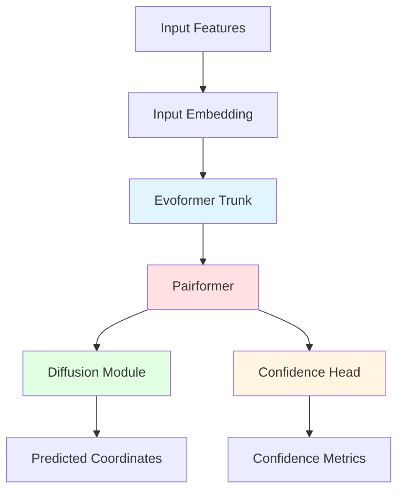

## Architecture Overview

AlphaFold 3 employs a sophisticated neural network architecture that combines evolutionary reasoning, structural attention mechanisms, and diffusion-based coordinate generation. The architecture consists of four major modules operating in sequence.

<Info>
The AlphaFold 3 architecture is implemented using JAX and Haiku, enabling efficient GPU computation and automatic differentiation.
</Info>

## High-Level Architecture



## Module 1: Input Embedding

### Purpose

Transform raw features into learned representations suitable for the Evoformer trunk.

### Token Features

Input features are first embedded into continuous representations:

```python
# From src/alphafold3/model/network/featurization.py
def create_target_feat_embedding(
    batch: feat_batch.Batch,
    config: evoformer_network.Evoformer.Config,
    global_config: model_config.GlobalConfig,
) -> jnp.ndarray:
    """Create target feature embedding."""
```

**Key embeddings**:

<Accordion title="Residue Type Embedding">
Each token's residue/ligand type is embedded:

```python
# One-hot encoding of residue types
# Dimension: num_tokens → seq_channel (384)
residue_embed = LinearLayer(num_residue_types, 384)(token_type)
```

Handles:
- 20 standard amino acids + unknown
- 4 RNA bases (A, C, G, U)
- 4 DNA bases (A, C, G, T)
- Ligand type indicators
- Modified residues via CCD codes
</Accordion>

<Accordion title="Positional Encoding">
Encodes token position and chain information:

```python
# From src/alphafold3/model/network/featurization.py
def create_relative_encoding(
    seq_features: features.TokenFeatures,
    max_relative_idx: int = 32,
    max_relative_chain: int = 2,
) -> jnp.ndarray:
    """Creates relative position encodings."""
```

Features:
- Relative token distance (clipped to ±32)
- Same chain vs different chain
- Chain separation distance
- N-terminal/C-terminal indicators
</Accordion>

<Accordion title="Chemical Features">
For ligands and modified residues:

```python
# Element types, charges, aromaticity
# Bond connectivity, hybridization
# Partial charges, chemical group indicators
```

Derived from:
- Chemical Component Dictionary (CCD)
- RDKit molecular descriptors
- Custom chemical annotations
</Accordion>

### Pair Features

Pairwise relationships are initialized from token features:

```python
# From src/alphafold3/model/network/evoformer.py:94
def _seq_pair_embedding(
    self,
    token_features: features.TokenFeatures,
    target_feat: jnp.ndarray,
) -> tuple[jnp.ndarray, jnp.ndarray]:
    """Generate pair embedding from sequence."""
    
    left_single = hm.Linear(
        self.config.pair_channel, name='left_single'
    )(target_feat)
    right_single = hm.Linear(
        self.config.pair_channel, name='right_single'
    )(target_feat)
    
    pair_act = left_single[:, None, :] + right_single[None, :, :]
```

**Initial pair representation** `[num_tokens, num_tokens, 128]`:
- Outer product of single representations
- Relative positional encodings
- Distance and orientation features (from templates)

## Module 2: Evoformer Trunk

### Purpose

Process MSA and template information to build rich single and pair representations capturing evolutionary and structural patterns.

### Architecture Configuration

```python
# From src/alphafold3/model/network/evoformer.py:37
class Config:
    max_relative_chain: int = 2
    msa_channel: int = 64
    seq_channel: int = 384
    max_relative_idx: int = 32
    num_msa: int = 1024
    pair_channel: int = 128
```

### MSA Stack

Processes multiple sequence alignments through attention layers:

```python
# From src/alphafold3/model/network/modules.py
class EvoformerIteration(hk.Module):
    """Single iteration of MSA processing."""
```

<Steps>
  <Step title="MSA Row Attention">
    Attention across sequences for each position
    
    ```python
    # Self-attention over MSA rows (sequences)
    # Shape: [num_msa, num_tokens, msa_channel]
    msa_act = RowAttention()(msa_act, pair_act)
    ```
    
    Learns which sequences are informative for each position.
  </Step>
  
  <Step title="MSA Column Attention">
    Attention across positions for each sequence
    
    ```python
    # Self-attention over MSA columns (positions)
    msa_act = ColumnAttention()(msa_act)
    ```
    
    Captures positional dependencies and co-evolution.
  </Step>
  
  <Step title="MSA Transition">
    Position-wise feed-forward network
    
    ```python
    # MLP per MSA element
    msa_act = Transition()(msa_act)
    ```
  </Step>
  
  <Step title="Outer Product Mean">
    Update pair representation from MSA
    
    ```python
    # Outer product of MSA columns → pair update
    pair_act += OuterProductMean()(msa_act)
    ```
    
    Transfers co-evolution information to pair representation.
  </Step>
</Steps>

<Note>
The MSA stack typically runs for 4 blocks, extracting progressively refined evolutionary features.
</Note>

### Template Processing

Structural templates are integrated via specialized modules:

```python
# From src/alphafold3/model/network/template_modules.py
class TemplateEmbedding(hk.Module):
    """Embeds template features into pair representation."""
```

<Accordion title="Template Pair Features">
Generate pairwise features from template structures:

```python
def template_pair_stack(
    templates: features.TemplateFeatures,
    pair_act: jnp.ndarray,
) -> jnp.ndarray:
    """Process template pairs through attention."""
```

Features computed from template coordinates:
- **Distances**: Cα-Cα distances between residues
- **Orientations**: Relative backbone orientations
- **Backbone angles**: ψ, φ, ω dihedral angles
- **Unit vectors**: Normalized direction vectors

Shape: `[num_templates, num_tokens, num_tokens, template_pair_dim]`
</Accordion>

<Accordion title="Template Point Attention">
Aggregate template information via attention mechanism:

```python
# Attention over templates
# Query: pair_act [num_tokens, num_tokens, pair_channel]
# Key/Value: template_pairs [num_templates, num_tokens, num_tokens, ...]
pair_act += TemplatePointAttention()(pair_act, template_pairs)
```

The attention weights determine which templates are most relevant for each token pair.
</Accordion>

### Single and Pair Updates

The single representation is maintained alongside the pair representation:

```python
# Single representation updates from pair
single_act = SingleFromPair()(single_act, pair_act)

# Pair representation updates
pair_act = TriangleMultiplication()(pair_act)
pair_act = TriangleAttention()(pair_act)
```

**Triangle Operations**:

<Accordion title="Triangle Multiplicative Update">
Propagates information along triangle edges:

```python
# Outgoing edges
pair_act_{ij} += Σ_k pair_act_{ik} ⊙ pair_act_{jk}

# Incoming edges
pair_act_{ij} += Σ_k pair_act_{ki} ⊙ pair_act_{kj}
```

This captures transitive relationships: if i-k and k-j are related, then i-j are related.
</Accordion>

<Accordion title="Triangle Self-Attention">
Attention along triangle edges:

```python
# Starting node attention
pair_act_{ij} += Attention_k(pair_act_{ik})

# Ending node attention
pair_act_{ij} += Attention_k(pair_act_{kj})
```

Aggregates information from all triangles involving edge (i,j).
</Accordion>

## Module 3: Pairformer

### Purpose

Deep refinement of single and pair representations through 48 transformer-like blocks without MSA.

### Architecture

```python
# From src/alphafold3/model/network/evoformer.py:33
class PairformerConfig:
    block_remat: bool = False
    remat_block_size: int = 8
    num_layer: int = 48  # 48 Pairformer blocks
```

### Pairformer Iteration

Each of the 48 blocks performs:

```python
# From src/alphafold3/model/network/modules.py
class PairFormerIteration(hk.Module):
    """Single Pairformer block."""
```

<Steps>
  <Step title="Single Representation Update">
    Self-attention over tokens with pair bias
    
    ```python
    # Attention with pair bias
    single_act = SingleAttentionWithPairBias()(
        single_act, 
        pair_act  # Used as attention bias
    )
    ```
    
    The pair representation biases attention weights, incorporating pairwise information.
  </Step>
  
  <Step title="Single Transition">
    Feed-forward network per token
    
    ```python
    single_act = Transition(
        num_intermediate_factor=4
    )(single_act)
    ```
  </Step>
  
  <Step title="Pair Updates">
    Triangle operations and pair attention
    
    ```python
    pair_act = TriangleMultiplication()(pair_act)
    pair_act = TriangleAttention()(pair_act)
    pair_act = PairTransition()(pair_act)
    ```
  </Step>
</Steps>

<Info>
**Computational Cost**: The 48 Pairformer layers are the most computationally intensive part of the network. For large proteins, these layers dominate inference time.

Memory optimization: Block rematerialization (`block_remat=True`) recomputes activations during backprop to save memory.
</Info>

### Per-Atom Conditioning

After Pairformer, per-atom conditioning refines representations:

```python
# From src/alphafold3/model/network/atom_cross_attention.py
class AtomCrossAttEncoderConfig:
    per_token_channels: int = 384
    per_atom_channels: int = 128
    atom_transformer_num_blocks: int = 3
```

This module:
- Expands token representations to atom-level
- Runs transformer over atoms within each token
- Cross-attends between atoms and tokens
- Prepares atom-level features for diffusion module

## Module 4: Diffusion Module

### Purpose

Generate 3D atomic coordinates through a learned reverse diffusion process.

### Diffusion Framework

AlphaFold 3 uses a **score-based diffusion model**:

```python
# From src/alphafold3/model/network/diffusion_head.py:30
SIGMA_DATA = 16.0  # Data scale in Ångströms

def noise_schedule(t, smin=0.0004, smax=160.0, p=7):
    """Noise level as function of diffusion time."""
    return (
        SIGMA_DATA
        * (smax ** (1 / p) + t * (smin ** (1 / p) - smax ** (1 / p))) ** p
    )
```

### Sampling Process

<Steps>
  <Step title="Initialize Noisy Coordinates">
    Sample initial coordinates from high-noise distribution
    
    ```python
    # Initial noise level: σ = 160 Å
    x_noisy = jax.random.normal(key, shape=atom_positions_shape)
    x_noisy = x_noisy * noise_schedule(t=0)
    ```
  </Step>
  
  <Step title="Iterative Denoising">
    Apply learned denoising steps
    
    ```python
    for step in range(num_diffusion_steps):
        # Predict denoised coordinates
        x_pred = diffusion_transformer(
            x_noisy, 
            single_repr, 
            pair_repr, 
            noise_level
        )
        
        # Update with next noise level
        x_noisy = denoise_step(x_noisy, x_pred, noise_level)
    ```
    
    Default: 200 denoising steps from σ=160 to σ=0.0004
  </Step>
  
  <Step title="Generate Multiple Samples">
    Produce diverse predictions
    
    ```python
    samples = []
    for _ in range(num_samples):  # Default: 5
        sample = run_diffusion_sampling(...)
        samples.append(sample)
    ```
  </Step>
</Steps>

### Diffusion Transformer

The core denoising network:

```python
# From src/alphafold3/model/network/diffusion_transformer.py
class DiffusionTransformer(hk.Module):
    """Transformer for diffusion denoising."""
```

**Architecture**:

<Accordion title="Adaptive Layer Normalization">
Conditioning mechanism using single representations:

```python
# From src/alphafold3/model/network/diffusion_transformer.py:24
def adaptive_layernorm(x, single_cond, name):
    """Adaptive LayerNorm conditioned on single_cond."""
    
    x = LayerNorm(create_scale=False, create_offset=False)(x)
    
    # Condition scale and bias on single_cond
    scale = Linear(x.shape[-1])(single_cond)
    bias = Linear(x.shape[-1])(single_cond)
    
    x = sigmoid(scale) * x + bias
    return x
```

Allows the network to modulate processing based on sequence and evolutionary context.
</Accordion>

<Accordion title="Transformer Blocks">
Each block contains:

```python
# Self-attention over atoms
atom_act = SelfAttention()(atom_act, pair_bias)

# Feed-forward with GLU activation
atom_act = TransitionBlock(
    num_intermediate_factor=2,
    use_glu_kernel=True  # Gated Linear Unit
)(atom_act)
```

**Gated Linear Units (GLU)**:
```python
# From src/alphafold3/model/network/diffusion_transformer.py:92
c = gated_linear_unit(
    x=x, 
    weights=weights, 
    activation=jax.nn.swish
)
# c = swish(x @ W_gate) ⊙ (x @ W_value)
```

GLU improves gradient flow and model capacity.
</Accordion>

<Accordion title="Noise Level Conditioning">
Diffusion time embedding:

```python
# From src/alphafold3/model/network/noise_level_embeddings.py
def fourier_embedding(noise_level, embedding_size=256):
    """Sinusoidal embedding of noise level."""
    
    freqs = jnp.exp(jnp.linspace(
        jnp.log(0.1), 
        jnp.log(100.0), 
        embedding_size // 2
    ))
    
    args = noise_level * freqs
    embedding = jnp.concatenate([
        jnp.cos(args), 
        jnp.sin(args)
    ])
    return embedding
```

Informs the network about current noise level, guiding denoising strength.
</Accordion>

### Random Augmentation

During training, random rigid-body transformations are applied:

```python
# From src/alphafold3/model/network/diffusion_head.py:44
def random_augmentation(
    rng_key: jnp.ndarray,
    positions: jnp.ndarray,
    mask: jnp.ndarray,
) -> jnp.ndarray:
    """Apply random rotation and translation."""
    
    # Random rotation (Gram-Schmidt)
    rot = random_rotation(rotation_key)
    
    # Random translation
    translation = jax.random.normal(translation_key, shape=(3,))
    
    # Apply transformation
    augmented_pos = (positions - center) @ rot + translation
    return augmented_pos
```

Improves generalization by removing position/orientation biases.

### Diffusion Hyperparameters

```python
# From src/alphafold3/model/network/diffusion_head.py:92
class SampleConfig:
    steps: int                      # Number of denoising steps (200)
    gamma_0: float = 0.8            # Noise injection scale
    gamma_min: float = 1.0          # Minimum gamma
    noise_scale: float = 1.003      # Scale for stochastic noise
    step_scale: float = 1.5         # Denoising step size
    num_samples: int = 1            # Samples per seed (5 default)
```

These control the quality-diversity tradeoff:
- More steps → better quality, slower
- More samples → more diversity, slower
- Higher noise_scale → more stochastic, more diverse

## Module 5: Confidence Head

### Purpose

Predict confidence metrics for the structure without generating coordinates.

### Architecture

```python
# From src/alphafold3/model/network/confidence_head.py
class ConfidenceHead(hk.Module):
    """Predicts confidence metrics."""
```

### Predicted Metrics

<Accordion title="pLDDT (predicted LDDT)">
Per-atom local distance difference test:

```python
# Predict LDDT score for each atom
# Output: [num_atoms] with values 0-100
plddt_logits = ConfidenceHead()(
    single_repr, 
    pair_repr
)
plddt = softmax_to_score(plddt_logits)
```

**Binned prediction**:
- 50 bins from 0 to 100
- Softmax over bins
- Expected value = predicted pLDDT

Higher pLDDT indicates higher confidence in local structure.
</Accordion>

<Accordion title="PAE (Predicted Aligned Error)">
Pairwise error estimation:

```python
# Predict error in relative positions
# Output: [num_tokens, num_tokens] in Ångströms
pae_logits = PAEHead()(pair_repr)
pae = logits_to_distance(pae_logits)
```

**Interpretation**:
- PAE[i,j] = predicted error in position of token j when aligned on token i
- Lower values = higher confidence in relative positioning
- Used to identify domain boundaries and reliable interactions
</Accordion>

<Accordion title="Contact Probabilities">
Probability of tokens being in contact:

```python
# Predict contact probability (< 8 Å)
# Output: [num_tokens, num_tokens]
contact_prob = ContactHead()(pair_repr)
```

Used for:
- Interface prediction
- Contact map visualization
- Interaction analysis
</Accordion>

### Derived Metrics

From base predictions, aggregate metrics are computed:

```python
# From src/alphafold3/model/confidences.py

# pTM: Predicted TM-score
ptm = compute_tm_score(pae, num_residues)

# ipTM: Interface pTM
iptm = compute_interface_tm_score(pae, chain_boundaries)

# Ranking score
ranking_score = (
    0.8 * iptm + 
    0.2 * ptm + 
    0.5 * disorder_bonus - 
    100 * clash_penalty
)
```

## Memory and Compute Optimizations

### Precision

```python
# From src/alphafold3/model/model_config.py
class GlobalConfig:
    bfloat16: str = 'all'  # Options: 'all', 'none'
```

**bfloat16 (Brain Float 16)**:
- 16-bit floating point format
- Reduces memory by 2× vs float32
- Maintains float32 dynamic range
- Minimal accuracy loss

### Gradient Checkpointing

```python
# Remat (rematerialization) config
block_remat: bool = True
remat_block_size: int = 8
```

**How it works**:
- Don't store all intermediate activations
- Recompute activations during backward pass
- Trade compute for memory
- Essential for large proteins

### Attention Optimization

```python
# Use specialized attention kernels
from tokamax import attention_kernel

# Fused attention implementation
attention_output = tokamax.attention_kernel(
    query, key, value, bias
)
```

Tokamax provides optimized JAX kernels for:
- Attention computation
- Gated linear units
- Layer normalization

## Implementation Details

### Haiku Modules

AlphaFold 3 uses Haiku (JAX neural network library):

```python
import haiku as hk

class AlphaFold3Model(hk.Module):
    def __call__(self, batch):
        # Model forward pass
        single_repr, pair_repr = self.evoformer(batch)
        single_repr, pair_repr = self.pairformer(
            single_repr, pair_repr
        )
        coords = self.diffusion_module(
            single_repr, pair_repr
        )
        confidences = self.confidence_head(
            single_repr, pair_repr
        )
        return coords, confidences
```

**Advantages**:
- Clean separation of state and logic
- Easy parameter management
- Composable modules
- JAX transformations (jit, grad, vmap)

### JAX Transformations

```python
# JIT compilation for speed
@jax.jit
def predict(params, batch):
    return model.apply(params, batch)

# Gradient computation
grads = jax.grad(loss_fn)(params, batch)

# Vectorization
vmapped_fn = jax.vmap(fn, in_axes=(0,))
```

## Model Parameters

### Loading Checkpoints

```python
# From src/alphafold3/model/params.py
def load_model_parameters(model_dir: str) -> dict:
    """Load model parameters from checkpoint."""
    
    # Load JAX parameters
    params = load_checkpoint(model_dir)
    
    return params
```

**Checkpoint contents**:
- All neural network weights
- Layer normalization parameters
- Embedding matrices
- ~5GB total size (fp32)

### Parameter Initialization

Training initialization (reference only, inference uses pretrained):

```python
# From Haiku initializers
linear_init = hk.initializers.VarianceScaling(
    scale=1.0, 
    mode='fan_avg'
)

attention_init = hk.initializers.VarianceScaling(
    scale=2.0, 
    mode='fan_in'
)
```

## Scalability Considerations

### Token Scaling

Memory complexity by component:

| Component | Complexity | Example (1000 tokens) |
|-----------|------------|----------------------|
| Single repr | O(N) | 1000 × 384 = 0.4M |
| Pair repr | O(N²) | 1000² × 128 = 128M |
| Pairformer attention | O(N²) | Quadratic |
| Diffusion per step | O(A) | Linear in atoms |

**N** = number of tokens, **A** = number of atoms

<Info>
**Practical limits** (on 40GB A100):
- ~2000 tokens with full Pairformer
- ~5000 tokens with sparse attention approximations
- Ligands contribute fewer tokens than protein chains
</Info>

### Strategies for Large Systems

1. **Chain cropping**: Process subsets of chains
2. **Sparse attention**: Approximate long-range interactions
3. **Mixed precision**: bfloat16 throughout
4. **Gradient checkpointing**: Reduce activation memory

## Next Steps

<CardGroup cols={2}>
  <Card title="Overview" icon="map" href="/concepts/overview">
    Return to AlphaFold 3 overview
  </Card>
  
  <Card title="Inference Pipeline" icon="microchip" href="/concepts/inference-pipeline">
    Learn how to run inference
  </Card>
</CardGroup>
