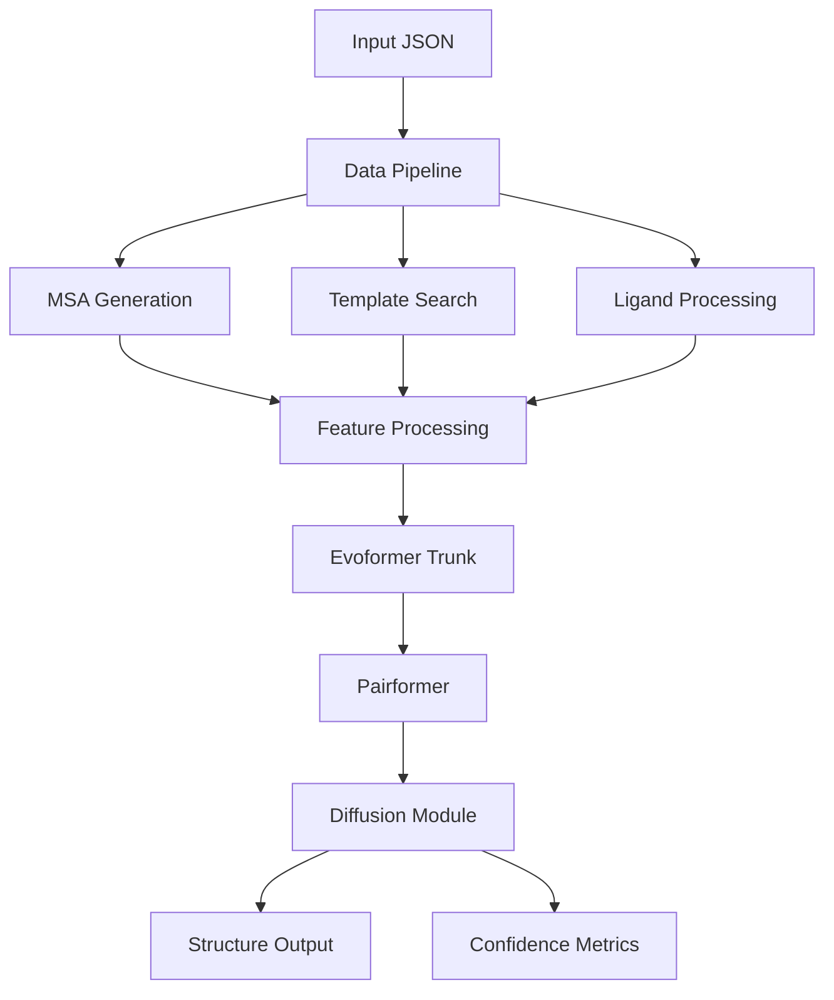

## Introduction

AlphaFold 3 represents a significant advancement in biomolecular structure prediction, capable of accurately predicting the structure and interactions of proteins, nucleic acids (DNA/RNA), ligands, ions, and modified residues. This implementation provides the inference pipeline for generating structure predictions.

<Note>
AlphaFold 3 builds upon the foundation of AlphaFold 2 and AlphaFold-Multimer, introducing a diffusion-based architecture that enables joint prediction of multiple biomolecular entity types.
</Note>

## Key Capabilities

AlphaFold 3 can predict structures for:

- **Proteins**: Including post-translational modifications (PTMs)
- **RNA and DNA**: Including modified bases
- **Ligands**: Specified via CCD codes, SMILES, or custom CCD definitions
- **Ions**: Treated as ligands (e.g., MG, ZN, CA)
- **Covalent Modifications**: Bonds between entities (e.g., covalent ligands, glycans)
- **Complexes**: Multi-chain assemblies with heterogeneous entity types

## Architecture Overview

The AlphaFold 3 architecture consists of three major components:

<Steps>
  <Step title="Data Pipeline">
    Processes input sequences to generate:
    - Multiple Sequence Alignments (MSAs) via genetic database searches
    - Structural templates from the PDB
    - Chemical component information for ligands
  </Step>
  
  <Step title="Neural Network">
    Transforms input features through:
    - Input featurization and embedding
    - Evoformer trunk for evolutionary and structural reasoning
    - Pairformer for token-level representations
    - Diffusion module for 3D coordinate generation
  </Step>
  
  <Step title="Confidence Prediction">
    Generates confidence metrics:
    - pLDDT (per-atom local distance difference test)
    - PAE (predicted aligned error)
    - pTM/ipTM (template modeling scores)
  </Step>
</Steps>

## High-Level Workflow



## Core Components

### Input Processing

The system accepts JSON inputs defining:
- Entity sequences (protein, RNA, DNA)
- Ligands (CCD codes or SMILES)
- Optional custom MSAs and templates
- Bonded atom pairs for covalent modifications
- Model seeds for reproducibility

Implementation: `src/alphafold3/common/folding_input.py`

### Token-Based Representation

AlphaFold 3 uses a **token-based** representation where:
- Each token represents a residue (protein/nucleic acid) or an entire ligand
- Token features encode sequence, chemical, and structural information
- Pair representations capture relationships between tokens

This abstraction allows unified handling of diverse molecular entities.

### Diffusion-Based Structure Generation

Unlike AlphaFold 2's structure module, AlphaFold 3 uses a **diffusion process**:

1. Starts with noisy atomic coordinates
2. Iteratively denoises through a learned reverse diffusion process
3. Employs a diffusion transformer conditioned on evolutionary and structural information
4. Generates multiple samples per seed for diversity

Implementation: `src/alphafold3/model/network/diffusion_head.py:30`

<Info>
The diffusion process uses SIGMA_DATA = 16.0 Å and applies random augmentation (rotation/translation) during training to improve generalization.
</Info>

## Model Configuration

The model architecture is configured through several key parameters:

```python
# From src/alphafold3/model/network/evoformer.py
class Config:
    msa_channel: int = 64          # MSA embedding dimension
    seq_channel: int = 384          # Single representation dimension
    pair_channel: int = 128         # Pair representation dimension
    max_relative_idx: int = 32      # Maximum relative position encoding
    num_msa: int = 1024             # Maximum MSA depth
    pairformer_num_layer: int = 48  # Number of Pairformer blocks
```

## Execution Modes

The system supports flexible execution through two main flags:

<Accordion title="Data Pipeline Mode">
CPU-only operation that runs genetic searches and template finding. Can be executed separately on machines without GPUs. Controlled by `--run_data_pipeline=true`.

Key components:
- Jackhmmer (protein MSA search against UniRef90, MGnify, Small BFD)
- Nhmmer (RNA/DNA MSA search)
- Hmmsearch (template search against PDB)
</Accordion>

<Accordion title="Inference Mode">
GPU-required operation that runs the neural network to generate structure predictions. Controlled by `--run_inference=true`.

The inference pipeline:
1. Loads model parameters from checkpoint
2. Processes features through the network
3. Runs diffusion sampling (default: 5 samples per seed)
4. Computes confidence metrics
5. Generates output CIF files and JSON confidences
</Accordion>

## Output Structure

For each prediction, AlphaFold 3 generates:

- **Structure files**: mmCIF format containing predicted coordinates
- **Confidence JSONs**: Full arrays (pLDDT, PAE, contact probabilities)
- **Summary JSONs**: Scalar metrics (pTM, ipTM, ranking scores)
- **Embeddings** (optional): Token and pair embeddings for downstream tasks
- **Distograms** (optional): Distance distributions between tokens

The top-ranked prediction (by ranking_score) is placed in the root output directory.

## Performance Characteristics

<Info>
**Memory Requirements**: Structure prediction scales with system size. A 5,000-token input produces:
- ~6 GB embeddings (single + pair)
- ~3 GB distogram
- Activations require substantial GPU memory (24GB+ recommended)
</Info>

**Computational Costs**:
- Data pipeline: CPU-intensive, hours for large proteins
- Inference: GPU-intensive, minutes per structure on modern GPUs
- Multiple seeds/samples increase runtime proportionally

## Key Design Principles

1. **Unified Architecture**: Single model handles all biomolecule types
2. **Token Abstraction**: Flexible representation supporting diverse entities
3. **Diffusion-Based Sampling**: Enables diverse, high-quality structure generation
4. **Confidence Estimation**: Comprehensive metrics for prediction quality assessment
5. **Modular Pipeline**: Separable data processing and inference stages

## Use Cases

AlphaFold 3 excels at:
- Protein-protein interactions
- Antibody-antigen complexes
- Protein-nucleic acid complexes
- Protein-ligand binding predictions
- Covalently modified proteins
- Custom ligand docking

## Next Steps

<CardGroup cols={2}>
  <Card title="Inference Pipeline" icon="microchip" href="/concepts/inference-pipeline">
    Learn how the inference pipeline processes inputs and generates predictions
  </Card>
  
  <Card title="Data Pipeline" icon="database" href="/concepts/data-pipeline">
    Understand MSA generation and template search processes
  </Card>
  
  <Card title="Model Architecture" icon="brain" href="/concepts/model-architecture">
    Deep dive into the neural network architecture
  </Card>
</CardGroup>
